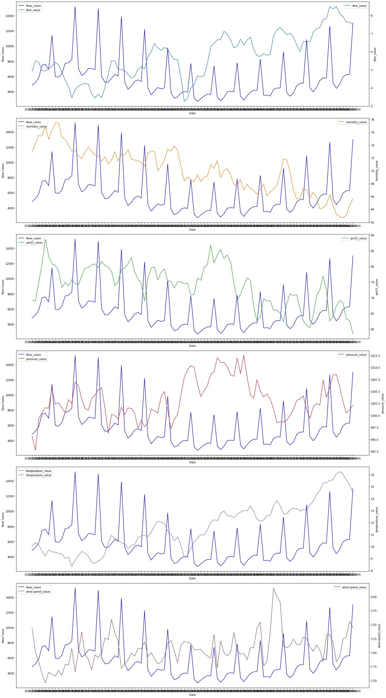
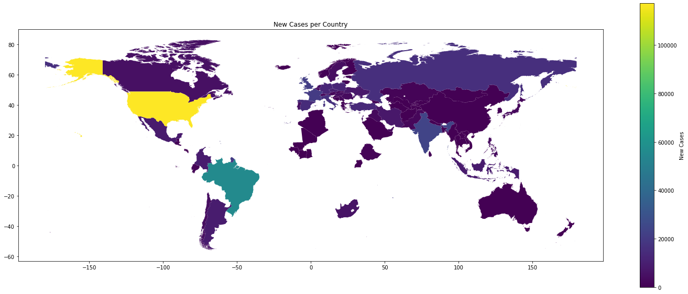
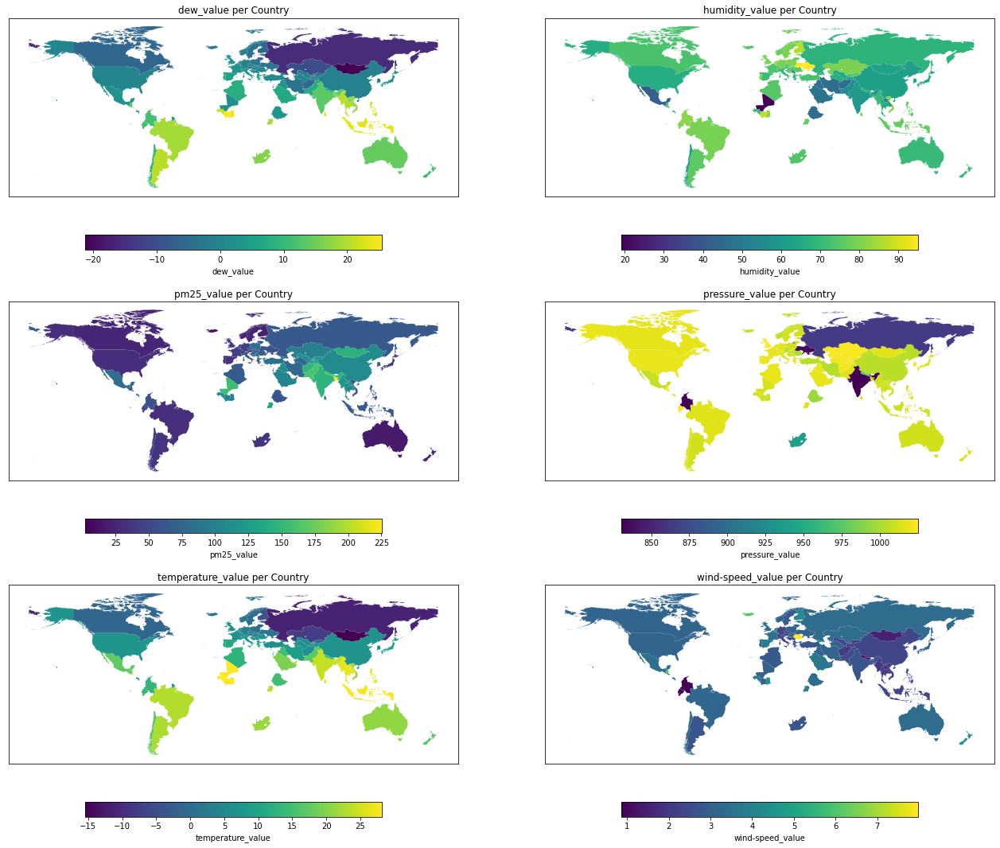

# Fınal Project-The Investigation of the relationship Between Covid-19 Cases and Air Quality

## Introduction
This project will examine the relationship between COVID-19 and air quality over time and location. Detailed explanations about the content of the project are available in 'Final proposal.ipynb'.

## Time Series Visualizations of new cases and other parameters: 

## Location Based Visualizations:

