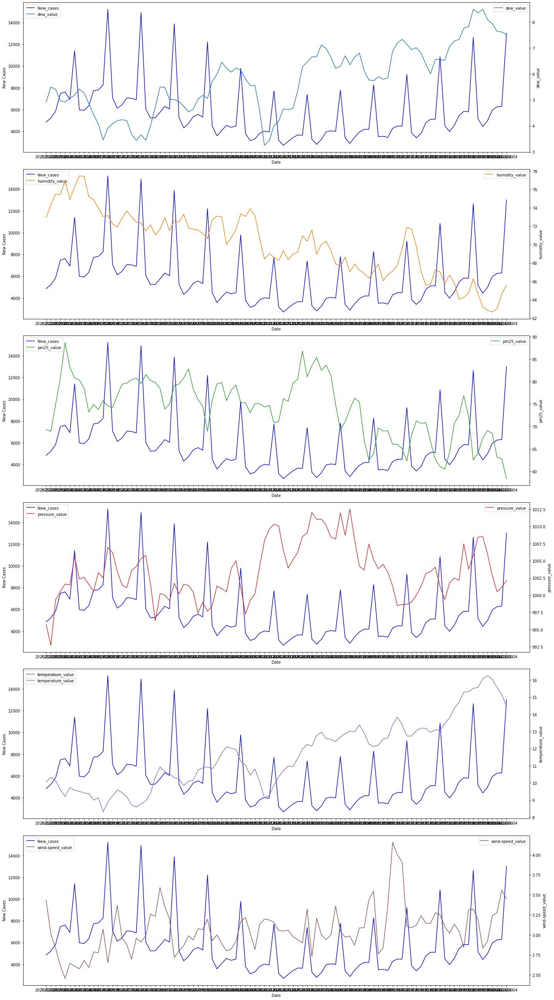
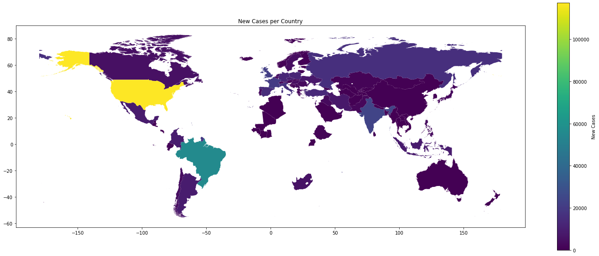
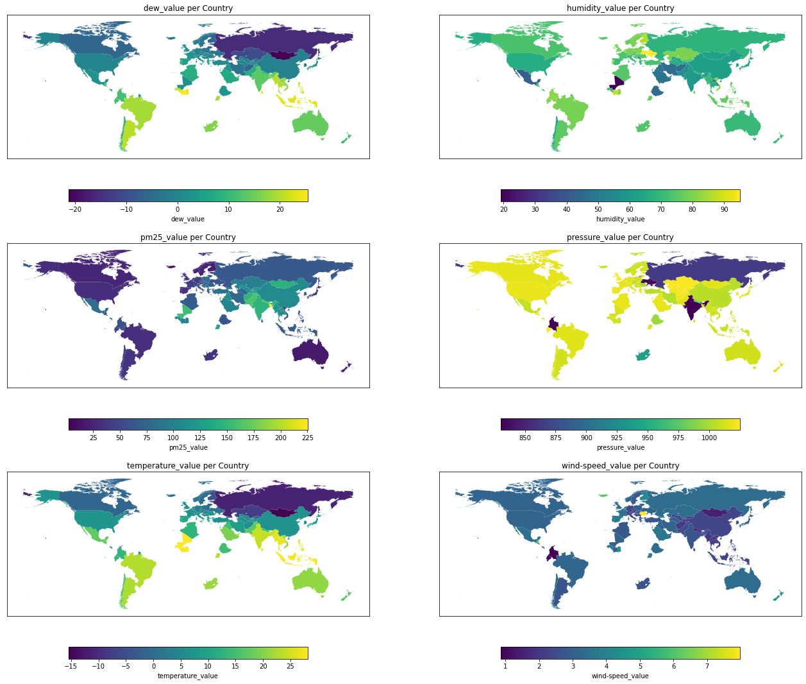

# The Investigation of the Relationship Between Covid-19 Cases and Air Quality

## Introduction
This project will examine the relationship between COVID-19 and air quality over time and location. 
- Detailed explanations about the content of the project are available in 'final_proposal.ipynb'.
- Main project file(including codes and evaluations) is 'final_project.ipynb'

## Time Series Visualizations of new cases and other parameters: 

## Location Based Visualizations:

